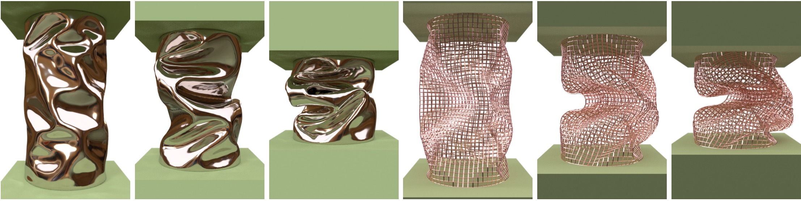

# *An Eigenanalysis of Angle-Based Deformation Energies*



This is the implementation and examples of the paper [An Eigenanalysis of Angle-Based Deformation Energies](https://www.cs.yale.edu/homes/wu-haomiao/publication/eigenbend.html). The code is based on the [HOBAK](https://github.com/theodorekim/HOBAKv1) project that comes with the SIGGRAPH course [Dynamic Deformables: Implementation and Production Practicalities(Now With Code!)](https://www.tkim.graphics/DYNAMIC_DEFORMABLES/) by [Theodore Kim](http://www.tkim.graphics/) and [David Eberle](https://www.linkedin.com/in/eberledavid/).

## Implementation

### Strand Energy Implementation

For strands, the F-based bending energies and their derivatives are implemented in `src/Hyperelastic/Strand/QUADRATIC_F_BENDING.cpp` and `src/Hyperelastic/Strand/TAN_BENDING.cpp`. In the functions `STRAND_NET_MESH::computeBendingClampedHessian` and `STRAND_NET_MESH::computeBendingForces` in `src/Geometry/STRAND_NET_MESH.cpp`, the F-based derivatives are converted into the position-based derivatives to be finally used for the solver.


### Shell Energy Implementation

For shells, the position-based derivatives are directly given in `src/Hyperelastic/Shell/QUADRATIC_F_BENDING.cpp`.  


### Projects

There are three projects inside `projects/`. The `simiulateShell` project runs a shell simulator and shows a bending V strip as an example. The `simulateStrand` project runs a net simulation example. The `unitTests` project runs a numerical test for the energy derivatives and print out the results.


## Building

Follow these steps to build a project:

1. Choose an include_top file according to your system. Inside `projects/`, there are three `include_top` files. Choose one and copy it into `include_top.mk`. For example, if you are running on Linux, run

   `cp include_top.linux include_top.mk`

2. To build a project, go to its directory and run `make depend`. Then run `make`. For example, to build the project `simulateShell`, at the root directory, run:

   ```shell
   cd projects/simulateShell
   make depend
   make
   ```


## Running

To run a project, go to the `bin/` directory and run the binary. For example, to run  the project `simulateShell`, after building it, run the following at the root directory:

```shell
cd ./bin
./simulateShell
```

Pressing `Esc` will close the OpenGL window. Pressing `a` starts or stops the animation. If you have [FFMPEG](https://ffmpeg.org/) installed, Pressing `q` will close the window and write out a video of the simulation in `bin/`.